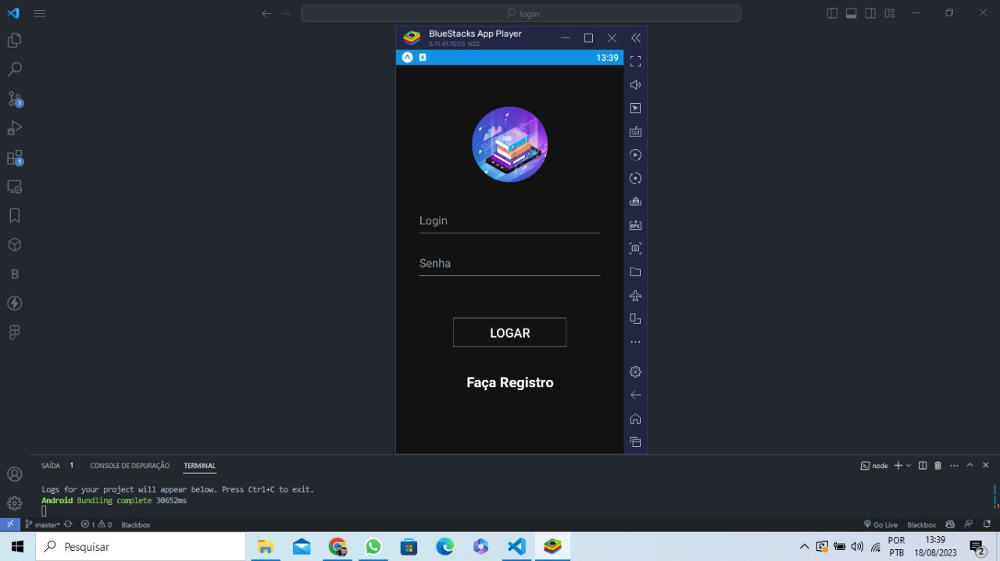
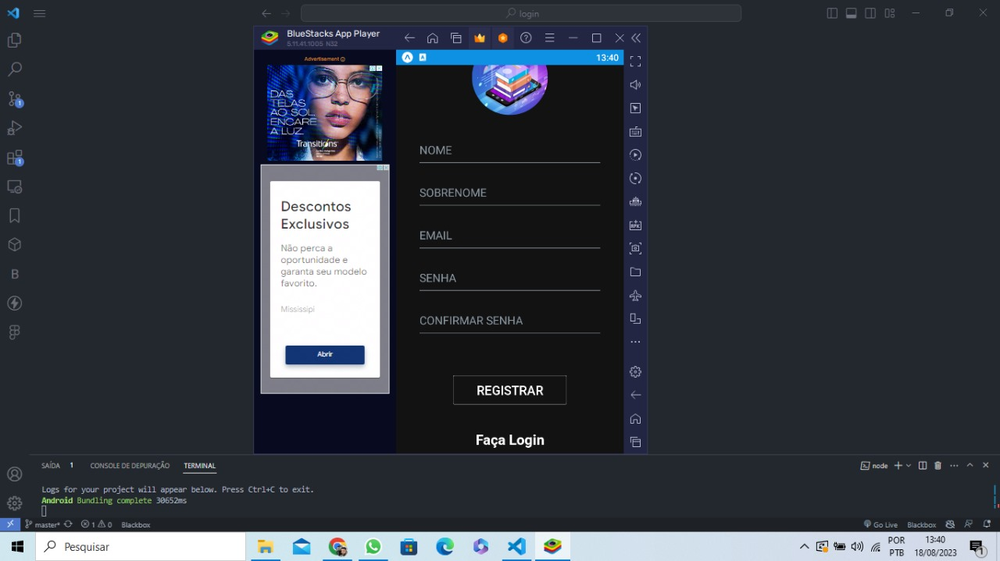

# Aplicativo de Login & Registro de Usuário.

## :Autor: Ihury Ferreira

-   [React Native](https://reactnative.dev/)
-   [Expo](https://expo.io/learn)

## 💻 Projeto

O projeto foi desenvolvido para didaticos
e estudo do framework React Native, utilizando o Expo como ambiente de execução. O aplicativo tem a finalidade de mostrar a tela de cadastro e a tela de Login.
Onde o objetivo era criar um aplicativo que simule as telas de Login e Cadastro.

## Image do Projeto

  

## Tecnologias utilizadas

-   ReactNative;
-   Expo;
